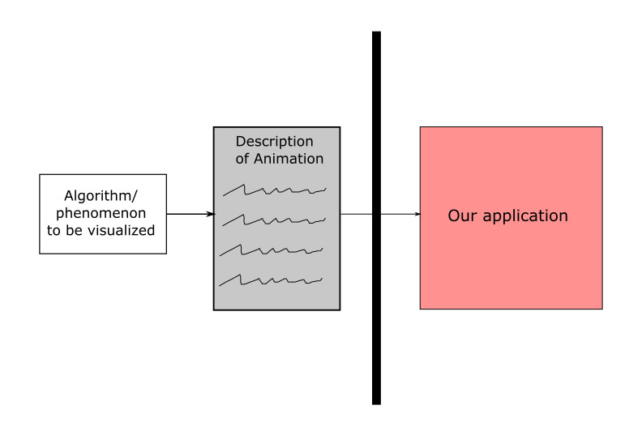

# The-Easy-Animator (OOD class project)

## Introduction
Pictures and moving pictures (animations) can be used to succinctly and effectively illustrate many things.\
In this project we using Model-View-Controller architecture to build an application that helps to create simple but effective 2D animations from simple shapes (such as the below examples).
#
Examples of animation:
#


#
Logic of Model-View-Controller design:
#



## Install and run
1. require a IntelliJ and Java version 11 on your computer
2. git clone the repository
  ```
  $ git clone https://github.com/YiqianDeng/The-Easy-Animator.git
  ```
3. Find the runable jar file location.
  ```
  $ cd resources
  ```
4. run this Assignment.jar file with required command field to run the application. \
Input file choice: big-bang-big-crunch.txt, buildings.txt, hanoi.txt, smalldemo.txt, toh-12.txt, toh-3.txt, toh-5.txt, toh-8.txt\
view choice: text, visual\
speed choice best range: 1 - 30, where 1 is slowest animation and 30 is fastest.

  ```
  java -jar Assignment10.jar -in buildings.txt -view visual -out animationOutput -speed 10
  ```
